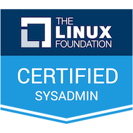

# 👋 Hi, nice to meet you!

### `$ whoami`

My name is Igor. I enjoy building great products using cutting-edge tech, meeting
new people, exchanging ideas, sharing experience, constantly gaining knowledge,
participating in the community, attending conferences and meetups.

### `$ which`

<ul class="certs">
<li><a href="https://www.youracclaim.com/badges/6fe47303-f268-40f8-9b31-2e66b12c86c8/public_url">&nbsp;CKA: Certified Kubernetes Administrator</a></li>
<li><a href="https://www.youracclaim.com/badges/75a251f6-c390-4a49-a5ba-002e72fc4631/public_url">&nbsp;LFCS: Linux Foundation Certified Systems Administrator</a></li>
</ul>

  
⚡️ GitHub Stats

  

